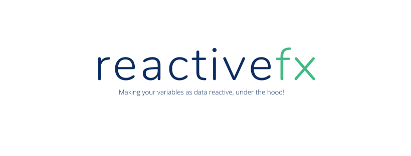

    

            
  

 
 
 

> :bulb: Project in premature state, contributors are more than welcome

## Supported

> :white_check_mark: Support &nbsp;&nbsp;&nbsp;&nbsp;:x: Not Supported

### :white_check_mark: `reactive`

### :white_check_mark: `ref`

### :white_check_mark: `computed`

### :white_check_mark: `watch`

---

## **:handshake: Contributing**

- Fork it!
- Create your feature branch: `git checkout -b my-new-feature`
- Commit your changes: `git commit -am 'Add some feature'`
- Push to the branch: `git push origin my-new-feature`
- Submit a pull request

---

### **:busts_in_silhouette: Credits**

- [Chris Michael](https://github.com/ChrisMichaelPerezSantiago) (Project Leader, and Developer)

---

### **:anger: Troubleshootings**

This is just a personal project created for study / demonstration purpose and to simplify my working life, it may or may
not be a good fit for your project(s).

---

### **:heart: Show your support**

Please :star: this repository if you like it or this project helped you!\
Feel free to open issues or submit pull-requests to help me improving my work.

---

### **:robot: Author**

_*Chris Michael*_

> You can follow me on
[github](https://github.com/ChrisMichaelPerezSantiago)&nbsp;&middot;&nbsp;[twitter](https://twitter.com/Chris5855M)

---

Copyright ©2020 [Reactivefx](https://github.com/ChrisMichaelPerezSantiago/reactivefx).